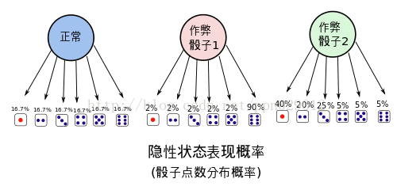
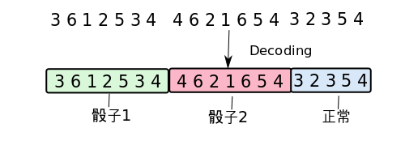

## 1. 赌场风云(背景介绍)

最近一个赌场的老板发现生意不畅，于是派出手下去赌场张望。经探子回报，有位大叔在赌场中总能赢到钱，玩得一手好骰子，几乎是战无不胜。而且每次玩骰子的时候周围都有几个保镖站在身边，让人不明就里，只能看到每次开局，骰子飞出，沉稳落地。老板根据多年的经验，推测这位不善之客使用的正是江湖失传多年的"**偷换骰子大法**”（编者注:偷换骰子大法，用兜里自带的骰子偷偷换掉均匀的骰子）。老板是个冷静的人，看这位大叔也不是善者，不想轻易得罪他，又不想让他坏了规矩。正愁上心头，这时候进来一位名叫HMM帅哥，告诉老板他有一个很好的解决方案。

> 不用近其身，只要在远处装个摄像头，把每局的骰子的点数都记录下来。
>
> 然后HMM帅哥将会运用其强大的数学内力，用这些数据推导出
>
> 1. 该大叔是不是在出千?
>
> 2. 如果是在出千，那么他用了几个作弊的骰子?　还有当前是不是在用作弊的骰子。
>
> 3. 这几个作弊骰子出现各点的概率是多少?

天呐，老板一听，这位叫HMM的甚至都不用近身，就能算出是不是在作弊，甚至都能算出别人作弊的骰子是什么样的。那么，只要再当他作弊时，派人围捕他，当场验证骰子就能让他哑口无言。

## 2. HMM是何许人也?

在让HMM开展调查活动之前，该赌场老板也对HMM作了一番调查。

HMM(Hidden Markov Model), 也称隐性马尔可夫模型，是一个概率模型，用来描述一个系统**隐性状态的转移**和**隐性状态的表现**概率。

系统的**隐性状态**指的就是一些外界不便观察(或观察不到)的状态，比如在当前的例子里面，系统的状态指的是大叔使用骰子的状态，即

$$\lbrace 正常骰子，作弊骰子1，作弊骰子2，...\rbrace$$

**隐性状态的表现**也就是，可以观察到的，由隐性状态产生的外在表现特点。这里就是说，骰子掷出的点数：

$$\lbrace 1,2,3,4,5,6\rbrace$$

HMM模型将会描述，系统隐性状态的转移概率。也就是大叔切换骰子的概率，下图是一个例子，这时候大叔切换骰子的可能性被描述得淋漓尽致。

很幸运的，这么复杂的概率转移图，竟然能用简单的矩阵表达，其中$a_{ij}$代表的是从i状态到j状态发生的概率

$$
A=
\left[
\begin{array}{ll}
    0.15 & 0.45 & 0.4 \newline
    0.25 & 0.35 & 0.4 \newline
    0.10 & 0.55 & 0.35
\end{array}
\right]
$$
 

当然同时也会有，**隐性状态表现转移概率**。也就是骰子出现各点的概率分布， (e.g. 作弊骰子1能有90%的机会掷到六，作弊骰子2有85%的机会掷到‘小’，即点数位1，2，3)。如下：

隐性状态的表现分布概率也可以用矩阵美丽地表示出来，其中$b_{i,j}$表示i状态的骰子得到j点数的概率：

$$
B=
\left[
\begin{array}{ll}
    0.167 & 0.167 & 0.167 & 0.167 & 0.167 & 0.167 \newline
    0.02 & 0.02 & 0.02 & 0.02 & 0.02 & 0.90 \newline
    0.40 & 0.20 & 0.25 & 0.05 & 0.05 & 0.05 
\end{array}
\right]
$$

把这两个东西总结起来，就是整个HMM模型。

这个模型描述了隐性状态的转换的概率，同时也描述了每个状态外在表现的概率的分布。总之，HMM模型就能够描述扔骰子大叔作弊的频率(骰子更换的概率)，和大叔用的骰子的概率分布。有了大叔的HMM模型，就能把大叔看透，让他完全在阳光下现形。

# 3. HMM能干什么!

总结起来HMM能处理三个问题，

1. 解码(Decoding)

解码就是需要从一连串的骰子中，看出来哪一些骰子是用了作弊的骰子，哪些是用的正常的骰子。

比如上图中，给出一串骰子序列(3,6,1,2..)和大叔的HMM模型, 我们想要计算哪一些骰子的结果(隐性状态表现)可能对是哪种骰子的结果(隐性状态).

2. 学习(Learning)

学习就是，从一连串的骰子中，学习到大叔切换骰子的概率，当然也有这些骰子的点数的分布概率。这是HMM最为恐怖也最为复杂的招数！！

3. 估计(Evaluation)

估计说的是，在我们已经知道了该大叔的HMM模型的情况下，估测某串骰子出现的可能性概率。比如说，在我们已经知道大叔的HMM模型的情况下，我们就能直接估测到大叔扔到10个6或者8个1的概率。

## 4. HMM是怎么做到的?

### 4.1 估计

估计是最容易的一招，在完全知道了大叔的HMM模型的情况下，我们很容易就能对其做出估计。
 
现在我们有了大叔的状态转移概率矩阵A，B就能够进行估计。比如我们想知道这位大叔下一局连续掷出10个6的概率是多少？如下

$$P(O_{1:10})=P(o_1=6, o_2=6, ..., o_T=6 \mid A, B, s_0=1)$$

这表示的是，在一开始隐性状态(s0)为1，也就是一开始拿着的是正常的骰子的情况下，这位大叔连续掷出10个6的概率。

现在问题难就难在，我们虽然知道了HMM的转换概率，和观察到的状态$V_{1:T}$, 但是我们却不知道实际的隐性的状态变化。

好吧，我们不知道隐性状态的变化，那好吧，我们就先假设一个隐性状态序列，假设大叔前5个用的是正常骰子，后5个用的是作弊骰子1，即

$$I_{1:10}=\{i_1=1, i_2=1, ..., i_6=3,..., i_{10}=3\}$$

好了，那么我们可以计算，在这种隐性序列假设下掷出10个6的概率

$$P(O_{1:10}\mid I_{1:10})=\prod_{t=1}^{10} P(o_t \mid i_t)$$

这个概率其实就是，隐性状态表现概率B的乘积

$$P(O_{1:10}\mid I_{1:10})=\prod_{t=1}^{10} P(o_t \mid i_t)=\prod_{t=1}^{10} b_{i_t, o_t}$$

但是问题又出现了，刚才那个隐性状态序列是我假设的，而实际的序列我不知道，这该怎么办。好办，把所有可能出现的隐状态序列组合全都试一遍就可以了。于是

$$
\begin{aligned}
    &\quad P(O_{1:T}) \newline
    &= \sum_{I_{1:T}} P(O_{1:T}, I_{1:T}) \newline
    &=\sum_{I_{1:T}} P(O_{1:T}\mid I_{1:T})\cdot P(I_{1:T}) \newline
    &=\sum_{I_{1:T}} P(O_{1:T}\mid I_{1:T})\prod_{t=1}^T P(i_t\mid i_{t-1}) \newline
    &=\sum_{I_{1:T}} \prod_{t=1}^T P(o_t \mid i_t) \prod_{t=1}^T P(i_t\mid i_{t-1}) \newline
    &=\sum_{I_{1:T}} \prod_{t=1}^T P(o_t \mid i_t) \cdot P(i_t\mid i_{t-1}) \newline
    &=\sum_{I_{1:T}} \prod_{t=1}^T b_{i_t, o_t} \cdot a_{i_{t-1}, i_t}
\end{aligned}
$$

现在问题好像解决了，我们已经能够通过尝试所有组合来获得出现的概率值，并且可以通过A，B矩阵来计算出现的总概率

但是问题又出现了，可能的集合太大了，比如有三种骰子，有10次选择机会，那么总共的组合会有$3^{10}$次...这个量级$O(c^T)$太大了，当问题再大一点时候，组合的数目就会大得超出了计算的可能。所以我们需要一种更有效的计算$P(O_{1:T})$概率的方法

$$
\begin{aligned}
    &\quad P(O_{1:T}) \newline
    &=\sum_{i_T} \underline{P(O_{1:T}, i_T)} \newline
    &=\sum_{i_T} P(O_{1:T-1}, o_T, i_T) \newline
    &=\sum_{i_T} P(o_T \mid i_T)\cdot  P(O_{1:T-1}, i_T) \newline
    &=\sum_{i_T} P(o_T \mid i_T) \sum_{i_{T-1}}P(O_{1:T-1},i_{T-1}, i_T) \newline
    &=\sum_{i_T} P(o_T \mid i_T) \left[\sum_{i_{T-1}} P(i_T \mid i_{T-1}) \cdot \underline{P(O_{1:T-1},i_{T-1})}\right]
\end{aligned}
$$

即

$$
P(O_{1:T}, i_T)=P(o_T \mid i_T) \left[\sum_{i_{T-1}} P(i_T \mid i_{T-1}) \cdot \underline{P(O_{1:T-1},i_{T-1})}\right]
$$

或可以写成

$$
P(O_{1:T}, i_T)=b_{i_T,o_T} \left[\sum_{i_{T-1}} a_{i_{T-1}, i_T} \cdot \underline{P(O_{1:T-1},i_{T-1})}\right]
$$

可以看出，这是一个从后向前的前向递归，递归基为

$$
P(O_{1:1}, i_1)=P(o_1, i_1)=b_{i_1,o_1} \sum_{i_0} a_{i_0, i_1}=b_{i_1,o_1}\cdot \pi_{i_1}
$$

$\sum_{i_0} a_{i_0, i_1}$之所以等于$\pi_{i_1}$，是因为$\sum_{i_0} a_{i_0, i_1}$表示从$i_0$状态转移到$i_1$的所有可能概率，而$i_0$为起始状态，只有一种可能性，其概率大小为$\pi_{i_1}$
